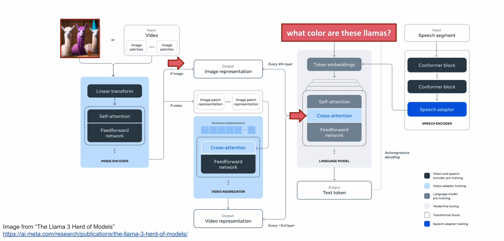
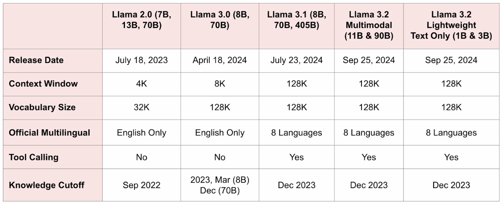

# Llama 3.2 and it's applications

## What is new in Llama 3.2
<b>Tokenizer : </b> 128K tokens

<b>Context Window: </b> A larger context window of 128K tokens 

<b>Languages: </b> Native support of 8 languages: English, German, French, Italian, Portuguese, Hindi, Spanish and Thai.

<b>Tool calling : </b> Native support of tool calling.

## Llama Versions

 

### Roles supported by Llama 3.1 and 3.2

**System**: 
    • Sets the context in which to interact with the AI model.
    • Typically includes rules, guidelines, or necessary information that helps the model respond effectively.

• **User**: 
    • Represents the human interacting with the model.
    • Includes the inputs, commands, and questions to the model.

• **Ipython**: 
    • A new role introduced in Llama 3.1.
    • Semantically, this role means "tool".
    • Used to mark messages with the output of a tool call when sent back to the model from the executor.

• **Assistant**: 
    • Represents the response generated by the AI model based on the context provided in the 'system', 'ipython', and 'user' prompts.

• **Each role is set between the special tokens**: 
    • `<|start_header_id|>` and `<|end_header_id|>`.

### Special tokens for single-turn and multi-turn chat
1. `<|begin_of_text|>` : Start of a prompt.
2. `<|start_header_id|>` : Start of a role a particular message. Possible roles are: system, user, assistant and ipython.
3. `<|end_header_id|>` : End of the role for a particular message.
4. `<|eot_id|>` : End of a turn, which can be the end of the model's interaction with the user or a tool.
5. `<|eom_id|>` : End of Message. A message represents a possible stopping point where the model can inform the execution enviroment that a tool call needs to be made.
6.  `<|python_tag|>` : A special tag used in the model's response to signify a tool call.
7. `<|finetune_right_pad_id|>` : Used for padding text sequences in a batch to the same length.
8. `<|end_of_text|>` : Model will cease to generate more tokens after this. This token is generated only by the base models.

